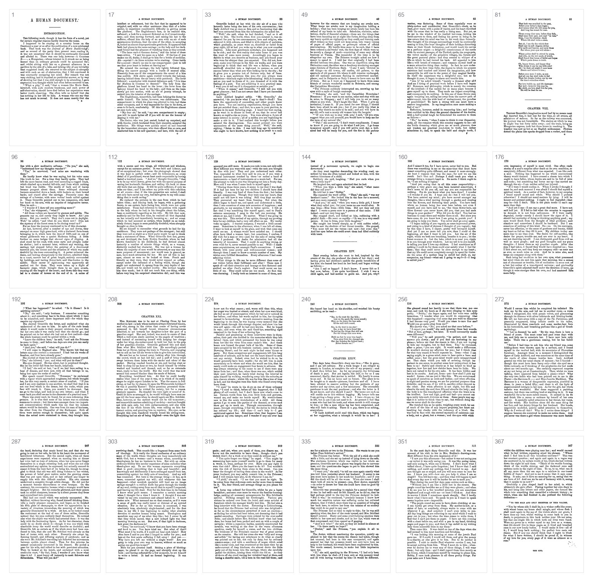

# humument

The canonical toolkit and data for computational work over **W. H. Mallock's
_A Human Document_ (1892)** — the one-volume Chapman & Hall "New Edition" that
Tom Phillips treated to make _A Humument_. It maps page-for-page onto that
edition, so page numbers here equal the **printed book page (= the _A Humument_
page), 1–367**.


_The CV pipeline across six pages — one row per stage: **1** raw scan → **2**
deskewed & cropped → **3** normalized B&W → **4** whitespace graph + word-rarity
features (rarest words highlighted). Read a column top-to-bottom to watch one page
get aligned, cleaned, and analysed._

This repository is two things:

- a **CV/OCR pipeline** (Python, run with [`uv`](https://docs.astral.sh/uv/))
  that turns the source PDF into a canonical OCR database and normalized page
  images, and
- a set of **npm packages** — a TypeScript library plus two data packages —
  that let anyone build Phillips-style erasure poetry from the book with zero
  configuration.

All OCR is local (macOS Vision); no cloud APIs are used.

📖 **Documentation:** <https://yz3440.github.io/humument/>

## The three npm packages

| Package | What it is | Size (unpacked) |
| --- | --- | --- |
| [`humument`](humument-lib) | Renderer-agnostic erasure-poetry primitives (words, OCR boxes, whitespace rivers, balloon/ribbon geometry). Zero runtime deps. | ~230 KB |
| [`humument-data`](data-packages/humument-data) | Per-page OCR JSON (words, bboxes, gutters, navigation graph), gzipped. | ~27 MB |
| [`humument-images`](data-packages/humument-images) | 367 normalized B&W page JPEGs. | ~126 MB |

`humument`'s defaults fetch `humument-data` and `humument-images` straight
from the jsDelivr CDN, so `Humument.load({ page: 33 })` works from any origin
without hosting anything. Data and images are **separate packages** — and pages
ship **gzipped** — because jsDelivr refuses any package over **150 MB
unpacked**; keeping them apart holds both comfortably under that ceiling.

## Zero-config example (Canvas2D)

The library is renderer-agnostic — every drawing primitive returns plain
`{x, y}` point arrays. Here with the browser's built-in Canvas2D:

```js
import { Humument } from 'humument'; // CDN: const { Humument } = HumumentLib;

const ctx = canvas.getContext('2d');
const H = await Humument.load({ page: 33 });
canvas.width = H.page.width;
canvas.height = H.page.height;

const img = new Image();
img.crossOrigin = 'anonymous';
img.src = H.page.imageUrl; // the lib never loads the image itself
await img.decode();
ctx.drawImage(img, 0, 0);

ctx.strokeStyle = '#141414';
ctx.fillStyle = '#ffffff';
for (const phrase of H.selectChunks({ nSeeds: 4, minLineDist: 3, seed: 42 })) {
  const outline = H.geom.balloon(H.bboxOf(phrase), { wobble: 0.15 }); // → [{x,y}, …]
  ctx.beginPath();
  outline.forEach((p, i) => (i ? ctx.lineTo(p.x, p.y) : ctx.moveTo(p.x, p.y)));
  ctx.closePath();
  ctx.fill();
  ctx.stroke();
}
```

See [`humument-lib/README.md`](humument-lib/README.md) for the full API, CDN
usage, and the data format.

## The pipeline

Requires macOS (for Vision OCR) and `uv`. From the repo root:

```sh
uv sync
make pipeline   # stages 01a → 03, in order
make verify     # validate + pytest + typecheck (the data-contract gate)
```

The stages ([`pipeline/`](pipeline), configured in
[`pipeline/config.py`](pipeline/config.py)):

- **01a `rasterize`** — PDF → `data/pages/*.jpg` at 300 dpi. The raster index
  is `printed_page + 9`; the offset is applied here and nowhere else, so every
  later stage works in printed-page space.
- **01b `ocr_raw`** — raw macOS Vision OCR → `data/humument.db`.
- **01c `correct_tilt`** — deskew, align, and re-OCR → `data/pages_corrected/`.
- **01d `normalize_color`** — B&W high-contrast normalization, shadow removal,
  text-bbox crop → `data/pages_normalized/`.
- **01e `features`** — tag every word with POS, lemma, frequency, rarity (spaCy
  + wordfreq).
- **02 `whitespace_graph`** — whitespace gutters, word docks, and the routing
  graph used to draw rivers of type.
- **03 `export_web`** — export the DB to static JSON under `output/db/`
  (catalog, per-page `pNNNN.json` + gzipped twin, search index). This is the
  payload published as `humument-data`.

`data/humument.db` is the **canonical OCR artifact** (keyed by `page_num`,
1–367). Apple Vision OCR is nondeterministic, so re-running the pipeline will
not reproduce it byte-for-byte — the DB is versioned here (via git-lfs) rather
than regenerated.

`data-packages/sync.mjs` copies the pipeline outputs into the two data packages
at publish time (`output/db` → `humument-data`; `data/pages_normalized` →
`humument-images`).



_The resulting dataset — 367 normalized B&W pages (a sample spread across the
book), published as `humument-images`._

## Building the docs

The documentation site (MkDocs, deployed to GitHub Pages) is built with `uv`:

```sh
uv sync --group docs      # or: uv pip install --group docs
uv run mkdocs serve       # live preview at http://127.0.0.1:8000
uv run mkdocs build       # one-off build → ./site (git-ignored)
```

Pages live in [`docs/`](docs); the nav and theme are configured in
[`mkdocs.yml`](mkdocs.yml). A push to `main` auto-deploys via
[`.github/workflows/docs.yml`](.github/workflows/docs.yml).

## Provenance

Scanned from the Internet Archive item
[`ahumandocumenta04mallgoog`](https://archive.org/details/ahumandocumenta04mallgoog)
(digitized by Google from a public-domain copy). The source PDF the pipeline
rasterizes is
[`ahumandocumenta04mallgoog.pdf`](https://archive.org/download/ahumandocumenta04mallgoog/ahumandocumenta04mallgoog.pdf).
The 1892 text is in the public domain; this code, the derived data, and the
packaging are **MIT-licensed** (see [`LICENSE`](LICENSE)).

> The multi-volume "three-decker" first edition has different pagination and
> does **not** line up with _A Humument_; this repo deliberately uses only the
> one-volume 1892 edition.
