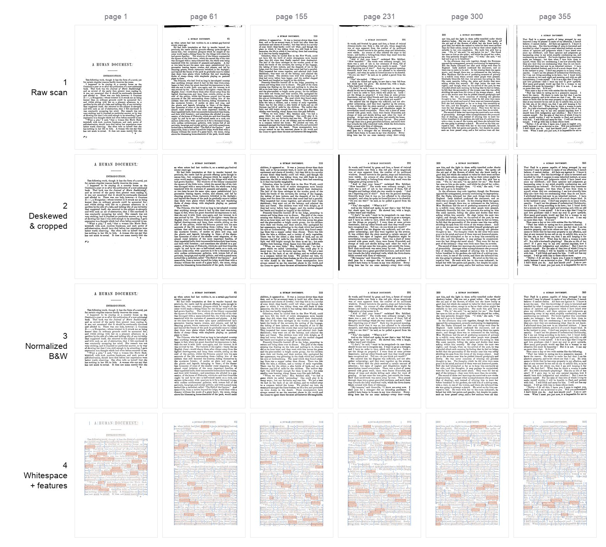

# humument

The canonical toolkit and data for computational work over
**W. H. Mallock's _A Human Document_ (1892)** — the one-volume Chapman & Hall
"New Edition" that **Tom Phillips** treated to make _A Humument_. It maps
page-for-page onto that edition, so page numbers here equal the **printed book
page (= the _A Humument_ page), 1–367**.

If you want to make Phillips-style **erasure poetry** — selecting a few words on
a scanned book page and drawing balloons and rivers of type around them —
programmatically, this project gives you the whole book (every page's words,
OCR boxes, and whitespace geometry) with **zero configuration**, ready to render
with any 2D API.

_The CV pipeline across six pages — one row per stage: **1** raw scan → **2**
deskewed & cropped → **3** normalized B&W → **4** whitespace graph + word-rarity
features (rarest words highlighted). Read a column top-to-bottom to watch one page
get aligned, cleaned, and analysed._

## What is erasure poetry?

Tom Phillips took a forgotten Victorian novel and, page by page, painted over
almost all of it — leaving a scattered handful of words connected by hand-drawn
"rivers" to form a new poem. `humument` reproduces the raw material for that
kind of work: the OCR'd words with their pixel positions, plus a precomputed map
of the whitespace between them so you can route rivers and wrap balloons without
re-deriving any geometry. See [Concepts](concepts.md) for the full vocabulary.

## Two halves

This repository is two things:

- a **CV/OCR pipeline** (Python, run with [`uv`](https://docs.astral.sh/uv/))
  that turns the source scanned PDF into a canonical OCR database and normalized
  page images — see [The Pipeline](pipeline.md); and
- a set of **npm packages** — a TypeScript library plus two data packages — that
  let anyone build erasure poetry from the book with zero configuration.

All OCR is local (macOS Vision); no cloud APIs are used.

## The three npm packages

| Package | What it is | Size (unpacked) |
| --- | --- | --- |
| [`humument`](api/index.md) | Renderer-agnostic erasure-poetry primitives (words, OCR boxes, whitespace rivers, balloon/ribbon geometry). Zero runtime deps. | ~230 KB |
| [`humument-data`](data/packages.md) | Per-page OCR JSON (words, bboxes, gutters, navigation graph), gzipped. | ~27 MB |
| [`humument-images`](data/packages.md) | 367 normalized B&W page JPEGs. | ~126 MB |

`humument`'s defaults fetch `humument-data` and `humument-images` straight
from the [jsDelivr](https://www.jsdelivr.com/) CDN, so `Humument.load({ page: 33 })`
works from any origin without hosting anything. See
[npm Packages](data/packages.md) for why data and images ship separately.

## Where to go next

- **[Quick Start](quickstart.md)** — a zero-config sketch: load a page and draw
  it with Canvas2D.
- **[Concepts](concepts.md)** — chunks, rivers, balloons, gutters, docks, and
  the coordinate system.
- **[Library API](api/index.md)** — the full `H.*` namespace and the
  `Humument` loader.
- **[Data Format](data/format.md)** — the JSON contract and the OCR database
  schema.

## License

The 1892 text is in the public domain; this code, the derived data, and the
packaging are **MIT-licensed**. See [Provenance & License](provenance.md).
